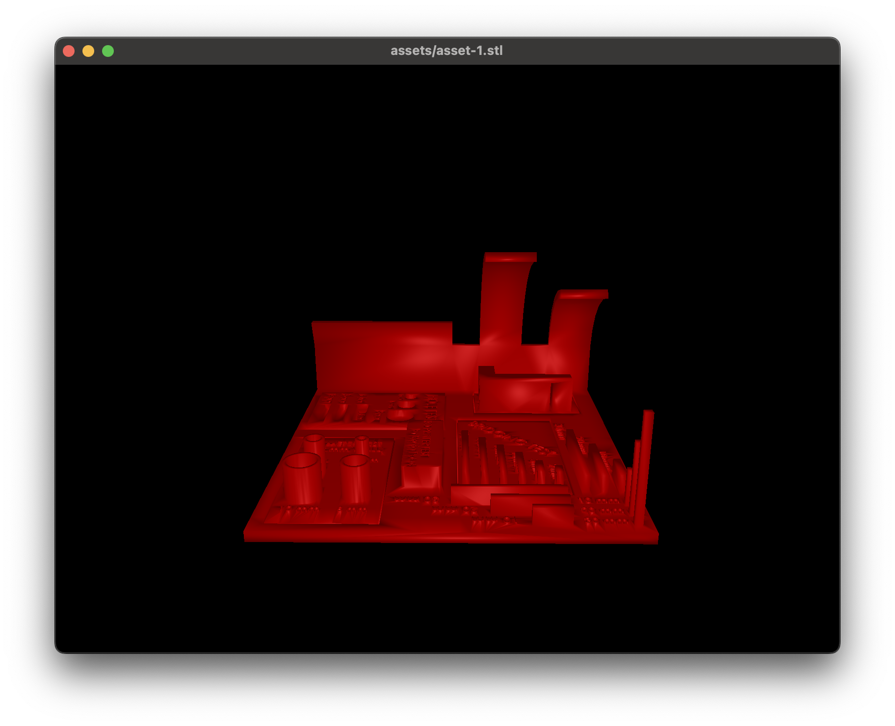

# Stlvi

STL viewer written in Rust. This project is still in development.
It is available in both CLI and GUI mode.

## Supported OS

- [x] Linux
- [x] Windows
- [x] Mac

## Screenshots



## Installation

This installation is only for development purpose. If you want to use this tool, please use the binary from the release page which is `Coming Soon`.

```bash
git clone https://github.com/mantreshkhurana/stlvi.git
cd stlvi
cargo install --path .
```

## Usage

```bash
stlvi path/to/model.stl
```

## Test

```bash
cargo run models/model-1.stl 
```

> Example: `stlvi models/model-1.stl`

## Contributing

Pull requests are welcome. For major changes, please open an issue first to discuss what you would like to change.

After forking `git clone https://github.com/mantreshkhurana/stlvi.git` and `cd stlvi` and then create a new branch for your changes.

```bash
git clone https://github.com/mantreshkhurana/stlvi.git
cd stlvi
git checkout -b <your-branch-name>
# After adding your changes
git add .
git commit -m "your commit message"
git push origin <your-branch-name>
```
